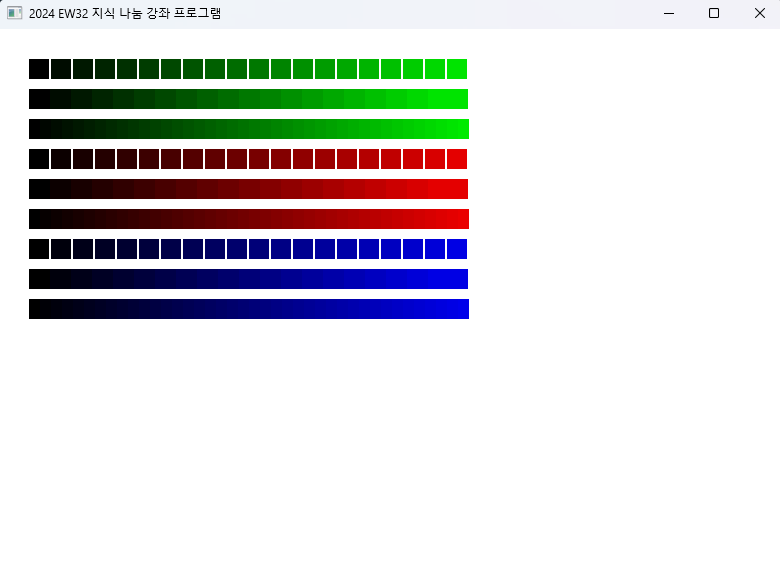
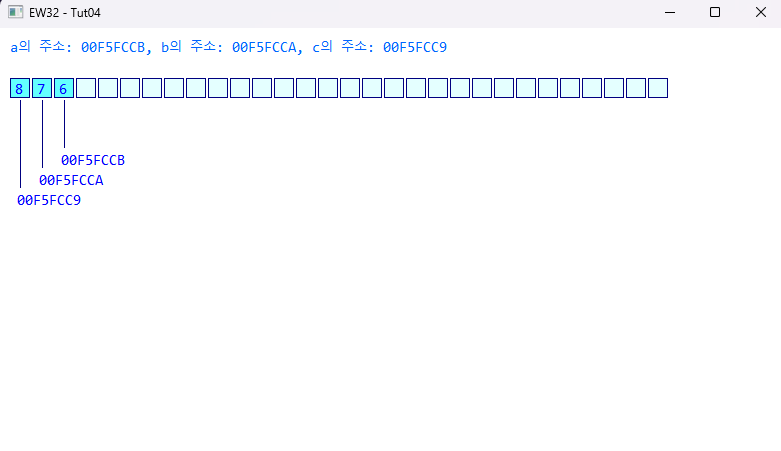

# EasyWin32 튜토리얼 
## C언어 기본 문법 숙지 및 EW32 라이브러리를 활용한 GUI 환경 기반에서의 실습 진행
## 학습 기간
> 24.4.2 ~ 24.4.16(계속 복습 중)

## 사용 언어
 
 

## 진행한 챕터
### 1. 프로그래밍과 메모리 그리고 C언어 - EasyWin32 기본 설명 및 간단한 문자열 출력하기 실습

### 2. C언어 기본 문법에 대한 설명 - 변수 실습(주소 계산 및 연속된 좌표 상의 사각형 출력하기 실습)

### 3. 실행 흐름 제어하는 방법 - 조건문 및 반복문 실습(마우스 클릭 시 사각형, 원그리기 실습, 선 그리기 실습, 격자 무늬 상태 변화 실습)

### 4. 시프트 연산자와 비트 연산자 그리고 변수의 유효 기간과 사용 범위 - 비트 및 시프트 연산자 실습(시프트와 비트 연산자 이동을 활용한 비트 계산기 실습)

### 5. 배열과 포인터 그리고 표준 입력 함수에 대하여 - 배열과 포인터 실습(메모리 위치, 오목 화면 그리기(바둑돌 포함), 랜덤 원 그리기 실습)

### 6. 메모리 할당과 다차원 포인터 그리고 구조체 - 메모리 할당, 다차원 포인터, 구조체 실습(랜덤 원 그리기, 채팅창 화면 구현, 파일 및 디렉토리 탐색 프로그램 실습)

 

## 왜 이것을 공부하는 가?
- Do it C언어 강좌를 수강하며 책을 읽으면서 콘솔 환경에서만 실습 코드를 작성하고 연습함
- 기존에 계속 사용하고 있던 EW32 라이브러리를 활용하여 다양한 예제를 만들어보면서 눈으로 직접 익히고자 실습 진행
- 이미 카페 매니저로 계신 김성엽 대표님께서 좋은 예제들을 많이 만들어 놓으시고 코드도 직접 사용하고 익힐 수 있도록 올려놓으심
- 이 코드를 바탕으로 추가할 만한 기능은 없는 지 탐색하고 나만의 프로그램을 만들고자 하기에 강좌보면서 익힘
- 찐(?)튜토리얼 느낌으로 복습하면서 C언어와 친밀감을 쌓기 위해 올려놓음

 
